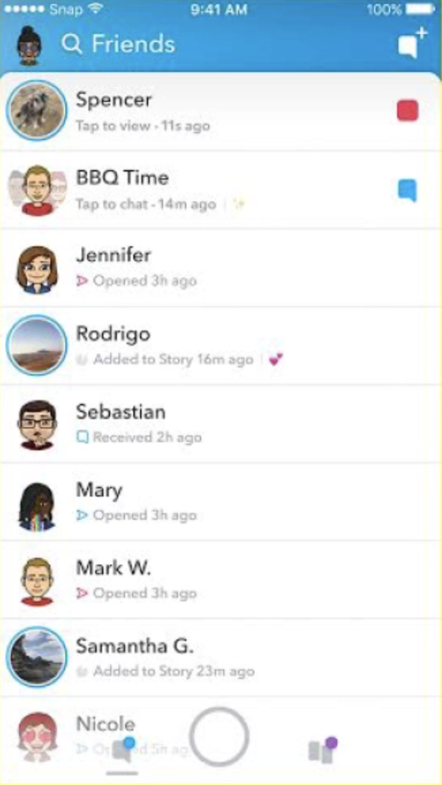

# DGL-114-ProcessPortfolio

## Week-1

### 0101

I like the netfix mobile app's interface.The best part about it is the simplicity involved in it. I like how the user can constantly navigate throught the search page, the home page, download page as well as the more page. The color combination used by them is quite good and isn't rough on the eye

The other app example would be the Facebook app. It's not that I hate it or dislike it,its just that it takes a while in order to get to know it better. I reckon there are quite a lot of features in it, but they just aren't quite presentable. As a user at times I used to get confused from where to upload a photo.Should it be using the camera button or the posts feature?And getting the same content on the feed at times bores me and makes me shut down the app

### 0102

The following are things in an app that I consider to be intutive which also makes them usable

- Good Speed
  - I like it when I don't have to wait for it to load content
- Privacy/Security
  - Giving acess to someone's data is very personal.When I give mine to an app, I expect confidentiality and discretion would be provided
- Color contrast
  - I would look at the Netflix home page for hours looking for a Movie than on facebook, simply because the colors used by Netflix is less painful to eyes
- Notification
  - I like it when Facebook provides me with notifications about my friend's birthday or at the event of someone liking/commenting on my post. It keeps the user informed

## Week-2

### 0201

The app that I use frequently is Snapchat and its <strong>features</strong> are as follows:- 

- location
- speakers 
- microphone
- camera
- touchscreen
- multitouch

<strong>permission :</strong> 
- Camera
- Microphone
- Notifications 
- Storage
- Contact

### 0202

The app that I use frequently is Snapchat

I will be identifing the MVC pattern in its friends page

The <strong>Model</strong> is as follows 

- The user icon at the top left 
- The users friends 
- The image of each user
- The groups that the user is part of

The <strong>View</strong> is as follows 

- Displaying each users activity 
- Ensuring that the images are at the left 
- The buttons at the bottom to change page

The <strong>Controller</strong> is as follows 

- Updating the user's friends' snaps
- Notifying the user if the receive a message
- Disabling the snap once viewed

## Week-3

### 0301

The app that I chosse is facebook.The activities in it are as follows:

  
  -  Camera
  -  Feed
  -  Search
  -  Messenger
  -  notifications 
  -  Marketplace

The app contains these features mainly in the header

### 0302

Facebook uses the following events

  -  onClick
    -  Clicking a profile to open it
    -  Clicking the like button to like a post
    -  Clicking on the header images to follow other activities 
    
  -  onLongPress
    -  Long pressing the like button would give other ways to react to a post
    
  -  onDoubleTap
    - double tapping an image zooms in the image

## Week-4

### 0401

App choosen Snapchat

I reckon snapchat is an app that has a flat structure. The top bar and bottom bar both provide different views and activities. The friends section of the app provides insight to the messages, which as well is a flat structure. The setting however shows some signs of hierarchy. It's an activity that provides the path to navigate towards different navigations

## 0403

After reading the provided resourses I feel that a top bar can be used without any actions, whereas a bottom bar is much prefered when we are dealing with multiple screens. The bottom bar in snapchat has multiple actions like moving to photos view or friends view. It is common to have a Floating Action Button (FAB) on a bottom bar.

There are certain differences when it comes to principles that govern the top and bottom bars: Top bars lean towards the principles of Persistent, Guiding, and Consistent, whereas the bottom bar leans towards Actionable, Flexible, and Ergonomic

